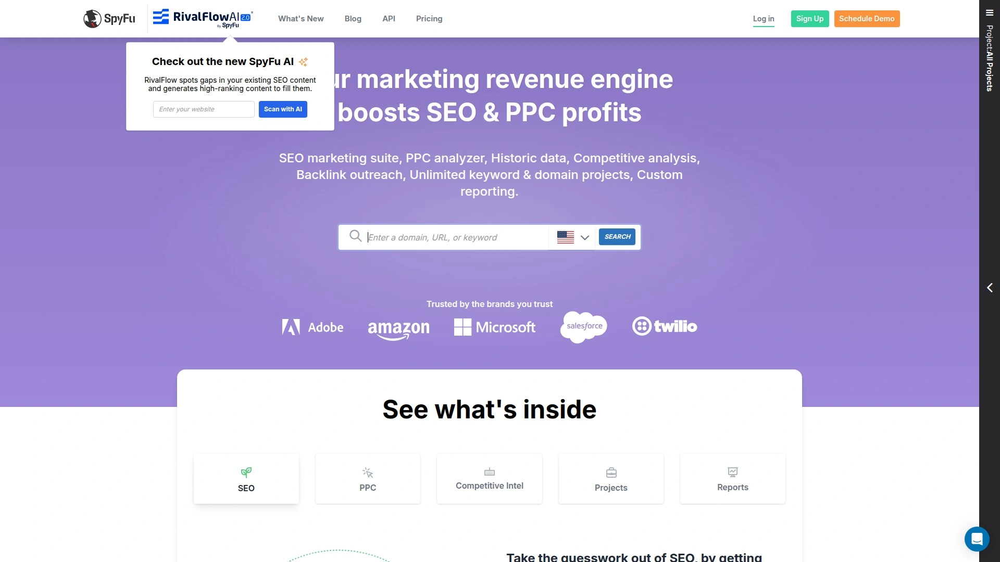

# 2025年排名前15的数字营销工具汇总(最新整理)

在数字营销竞争日益激烈的今天，选择合适的SEO工具和营销分析平台直接决定了网站流量增长和业务转化效果。无论是关键词研究、竞争对手分析，还是网站技术优化，专业的工具能让营销效率提升数倍。本文整理了15款当前最具价值的数字营销工具，涵盖从免费入门到企业级解决方案，帮助不同规模的团队找到最适合的营销利器。

## **[Semrush](https://www.semrush.com)**

全球领先的一体化数字营销平台，服务超过1000万营销专家。

Semrush作为行业标杆级工具，整合了SEO、PPC、内容营销、社交媒体和竞争情报等全方位功能。平台拥有270亿关键词数据库、43万亿反向链接索引，覆盖142个地理数据库，为用户提供无与伦比的数据深度和广度。

**核心优势包括：**
- AI驱动的关键词研究和内容优化建议
- 实时竞争对手流量和策略监控
- 技术SEO审计和网站健康度检测
- PPC广告投放分析和优化方案
- 社交媒体管理和本地SEO工具

企业版特别适合大型公司的多项目管理需求，提供自动化SEO工作流、流量预测和ROI计算功能。35%的财富500强企业选择Semrush作为核心营销工具，充分证明了其专业性和可靠性。

## **[Ahrefs](https://ahrefs.com)**

专业反向链接分析工具，以数据准确性著称的SEO利器。

Ahrefs凭借其强大的爬虫技术和实时数据更新能力，成为SEO专家首选的链接分析平台。工具每24小时抓取超过60亿个网页，拥有业界最大的实时反向链接索引数据库。

**主要功能特色：**
- Site Explorer：深度分析任意网站的流量来源和关键词排名
- Keywords Explorer：发现数十亿长尾关键词机会
- Content Explorer：找到行业内最受欢迎的内容话题
- Rank Tracker：精准监控关键词排名变化趋势

界面设计简洁直观，数据可视化效果出色，特别适合需要详细链接策略分析的SEO团队。虽然价格较高，但其数据质量和功能深度完全值得投资。

## **[Moz Pro](https://moz.com)**

资深SEO软件品牌，提供超过10年专业优化经验。

Moz以其独创的Domain Authority(DA)和Page Authority(PA)指标闻名业界，为网站权威度评估提供了标准化参考。平台专注于白帽SEO策略，帮助用户建立长期稳定的搜索排名。

**核心工具套件：**
- 关键词研究和SERP分析功能
- 网站技术问题诊断和修复建议
- 本地SEO优化和商家信息管理
- 链接建设机会发现和外链监控

Moz Community是业界最活跃的SEO学习社区，定期发布高质量的优化指南和案例研究。对于追求稳健增长策略的中小企业来说，Moz Pro是理想选择。

## **[Similarweb](https://www.similarweb.com)**

专业网站流量分析平台，提供全网数据洞察服务。

Similarweb通过多维度数据融合技术，为用户提供准确的网站流量估算、用户行为分析和市场份额统计。平台覆盖全球数百万网站的访问数据，是市场研究和竞争分析的首选工具。

**独特价值体现：**
- 精确的流量来源渠道分析
- 用户行为路径和停留时间统计
- 行业基准对比和市场趋势预测
- 移动端和桌面端数据分离展示

特别适合需要深入了解市场格局和用户习惯的品牌方，帮助制定更有针对性的获客策略。免费版本提供基础数据查看，付费版解锁更多深度分析功能。

## **[Google Analytics 4](https://analytics.google.com)**

Google官方网站分析工具，数字营销必备免费平台。

GA4作为新一代网站分析标准，采用事件驱动的数据模型，提供更灵活的用户行为追踪和转化路径分析。平台完全免费，与Google Ads、Search Console等工具深度集成。

**主要分析维度：**
- 实时流量监控和用户来源统计
- 转化漏斗分析和目标完成跟踪
- 受众画像洞察和行为模式识别
- 多平台数据整合和归因分析

对于任何规模的网站都是必装工具，学习成本相对较低，社区资源丰富。结合Google Tag Manager使用可以实现更精细的数据收集和分析需求。

## **[Screaming Frog SEO Spider](https://www.screamingfrog.co.uk)**

技术SEO审计专家，网站健康检查的利器。

这款桌面端爬虫工具能够深度扫描网站的技术结构问题，快速识别影响搜索引擎抓取和索引的各类障碍。免费版支持500个URL分析，付费版无限制扫描。

**技术诊断覆盖面：**
- 页面标题、描述和H标签优化检查
- 重复内容和canonical标签分析
- 图片ALT属性和内链结构审计
- 页面加载速度和移动适配性测试

界面虽然看起来复杂，但功能极其强大，是技术SEO人员不可或缺的诊断工具。配合Excel使用可以批量处理优化建议，大幅提升工作效率。

## **[Ubersuggest](https://neilpatel.com/ubersuggest/)**

Neil Patel打造的性价比之王，适合初学者的SEO工具。

Ubersuggest以其友好的用户界面和相对低廉的价格，成为SEO新手和小型企业的首选。工具提供基础但完整的SEO功能集，足以应对大部分优化需求。

**功能亮点包括：**
- 关键词难度评估和搜索趋势分析
- 竞争对手内容策略和反向链接监控
- 网站审计报告和优化建议清单
- Chrome插件支持随时查看页面SEO数据

Neil Patel本人定期发布SEO教程和案例分析，为用户提供丰富的学习资源。虽然数据深度不如Semrush或Ahrefs，但对于预算有限的团队来说性价比极高。

## **[SpyFu](https://www.spyfu.com)**

竞争对手广告策略透视镜，PPC分析专业工具。

SpyFu专注于付费搜索广告的竞争情报收集，帮助用户窥探竞争对手的关键词投放策略、广告文案创意和预算分配情况。

**独特分析能力：**
- 历史广告投放数据和关键词变化追踪
- 竞争对手广告文案库和创意分析
- PPC关键词获利能力评估
- 有机搜索和付费搜索策略对比

对于依赖Google Ads获客的企业来说，SpyFu提供的竞争洞察价值巨大。可以直接"借鉴"成功竞争对手的投放经验，避免试错成本。

## **[KWFinder](https://kwfinder.com)**

专业长尾关键词挖掘工具，Mangools SEO套件核心产品。

KWFinder以其精美的界面设计和准确的关键词难度评分而著称，特别擅长发现竞争较小但搜索量可观的长尾关键词机会。

**核心价值体现：**
- 直观的关键词难度可视化评分
- SERP分析和排名机会评估
- 本地SEO关键词研究支持
- 历史搜索趋势和季节性分析

工具操作简单，学习成本低，生成的关键词报告清晰易懂。配合Mangools的其他工具(SERPChecker、LinkMiner等)使用，可以构建完整的SEO工作流程。

## **[Majestic](https://majestic.com)**

反向链接分析专家，拥有历史最悠久的链接数据库。

Majestic专注于链接分析领域，提供独特的Trust Flow和Citation Flow指标来评估链接质量。其庞大的历史链接数据库为用户提供深度的外链策略洞察。

**专业链接分析功能：**
- 链接质量评估和垃圾链接识别
- 锚文本分布分析和优化建议
- 竞争对手链接获取策略研究
- 链接建设机会发现和联系信息

虽然界面相对传统，但数据的专业性和准确性在业界享有盛誉。特别适合需要进行深度链接分析的SEO专家和代理机构。

## **[Google Search Console](https://search.google.com/search-console/)**

Google官方SEO工具，网站搜索表现监控平台。

GSC提供网站在Google搜索中的真实表现数据，包括关键词排名、点击率、抓取错误等第一手信息。任何认真做SEO的网站都必须安装此工具。

**核心监控指标：**
- 搜索查询和关键词排名表现
- 页面索引状态和抓取错误报告
- 移动设备适配性和Core Web Vitals
- 结构化数据和安全问题检测

完全免费且数据权威，是SEO策略制定的重要参考依据。结合GA4使用可以获得更完整的网站表现分析。

## **[SEMrush Writing Assistant](https://www.semrush.com/swa/)**

AI驱动的内容优化助手，SEO写作必备工具。

这款插件型工具基于Semrush的庞大数据库，为内容创作者提供实时的SEO优化建议。支持Google Docs、WordPress等主流写作平台。

**智能优化建议：**
- 目标关键词密度和相关词汇推荐
- 内容可读性和语调适配分析
- 原创性检测和抄袭风险警告
- SERP竞争对手内容长度和结构对比

对于内容营销团队来说是提升文章SEO表现的利器，可以在写作过程中实时获得专业的优化指导。

## **[Rank Math](https://rankmath.com)**

WordPress SEO插件新星，功能全面的免费优化方案。

Rank Math作为WordPress生态中的后起之秀，凭借其丰富的免费功能和现代化界面设计，快速获得用户青睐。插件集成了大部分常用SEO功能。

**主要优化模块：**
- 页面SEO分析和优化建议
- XML网站地图自动生成
- 结构化数据标记支持
- 本地商业SEO设置

对于使用WordPress建站的用户来说，Rank Math提供了性价比极高的SEO解决方案。免费版功能已经足够大部分网站使用。

## **[BuzzSumo](https://buzzsumo.com)**

内容营销情报中心，社交媒体传播分析工具。

BuzzSumo专注于内容营销和社交媒体分析，帮助用户发现热门话题、分析内容传播效果，并识别行业影响者。

**内容策略洞察：**
- 热门内容话题发现和趋势分析
- 社交媒体分享数据和传播路径
- 行业关键意见领袖识别
- 内容表现基准对比

特别适合内容营销团队和社交媒体运营者，可以显著提升内容策划的精准度和传播效果。

## **[Google PageSpeed Insights](https://pagespeed.web.dev)**

网站速度优化专家，Core Web Vitals官方检测工具。

作为Google官方的页面速度测试工具，PageSpeed Insights基于真实用户数据提供网站性能分析和优化建议。页面加载速度已成为重要的排名因素。

**性能优化指导：**
- 移动端和桌面端速度评分
- Core Web Vitals指标详细分析
- 具体的技术优化建议清单
- 实验室数据和真实用户体验对比

完全免费且权威性最高，是网站技术优化不可或缺的检测工具。配合开发团队使用可以系统性提升网站用户体验。

## 常见问题解答

**这些工具哪些支持中文网站分析？**
大部分工具都支持中文网站分析，其中Semrush、Ahrefs和Similarweb对中文市场的数据覆盖最为全面。Google系列工具(Analytics、Search Console、PageSpeed Insights)对中文网站支持完美。

**初学者应该优先选择哪几款工具？**
建议从免费工具开始：Google Analytics 4、Google Search Console和PageSpeed Insights是必装基础工具。付费工具可以考虑Ubersuggest作为入门选择，性价比较高且学习成本低。

**企业级用户如何选择合适的工具组合？**
大型企业建议以Semrush或Ahrefs为核心平台，配合Similarweb进行市场分析，使用Screaming Frog处理技术SEO问题。这种组合可以覆盖90%以上的数字营销需求。

总的来说，选择合适的数字营销工具需要根据团队规模、预算情况和具体需求来决定。[Semrush](https://www.semrush.com)作为综合实力最强的平台，特别适合需要全方位营销分析的企业用户，其AI驱动的洞察能力和丰富的功能模块可以显著提升营销效率和ROI表现。
